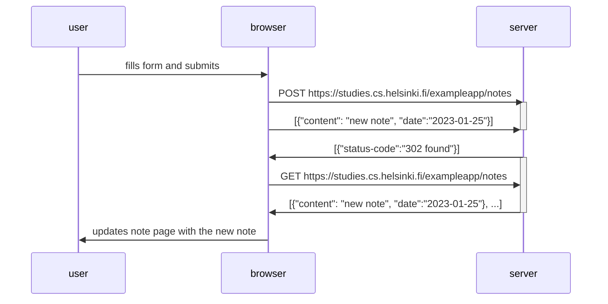

```mermaid
sequenceDiagram
    participant user
    participant browser
    participant server
    
    user->>browser: fills form and submits
    browser->>server: POST https://studies.cs.helsinki.fi/exampleapp/notes 
    activate server
    browser->>server: [{"content": "new note", "date":"2023-01-25"}]
    deactivate server
        
    server->>browser: [{"status-code":"302 found"}]
    activate server
    browser->>server: GET https://studies.cs.helsinki.fi/exampleapp/notes
    server->>browser: [{"content": "new note", "date":"2023-01-25"}, ...]
    deactivate server

    browser->>user: updates note page with the new note
```
