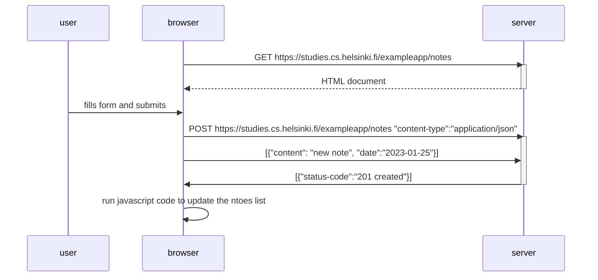

```mermaid
sequenceDiagram
    participant user
    participant browser
    participant server

    browser->>server: GET https://studies.cs.helsinki.fi/exampleapp/notes
    activate server
    server-->>browser: HTML document
    deactivate server
    
    user->>browser: fills form and submits
    browser->>server: POST https://studies.cs.helsinki.fi/exampleapp/notes "content-type":"application/json"
    activate server
    browser->>server: [{"content": "new note", "date":"2023-01-25"}]
    server->>browser: [{"status-code":"201 created"}]
    deactivate server
        
    browser->>browser: run javascript code to update the ntoes list
```
